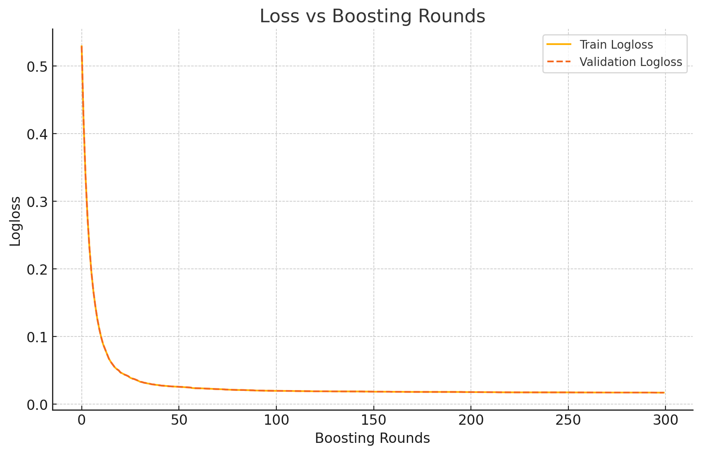
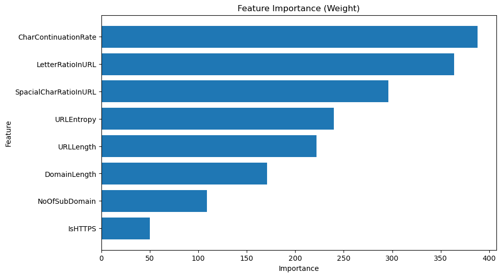
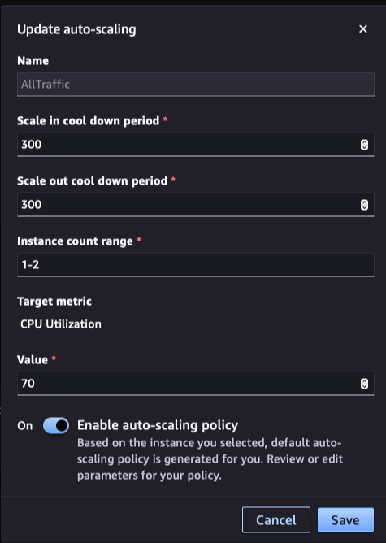
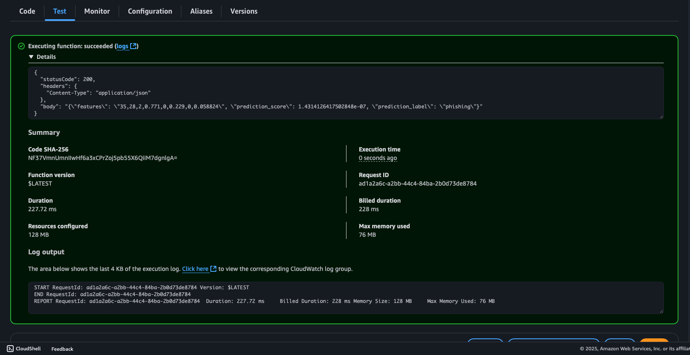
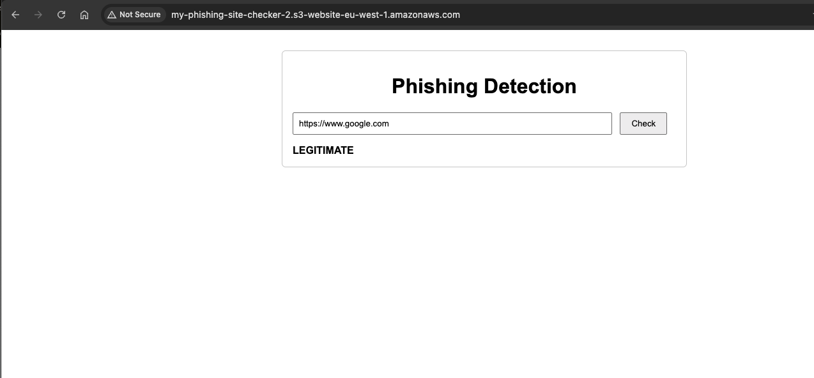
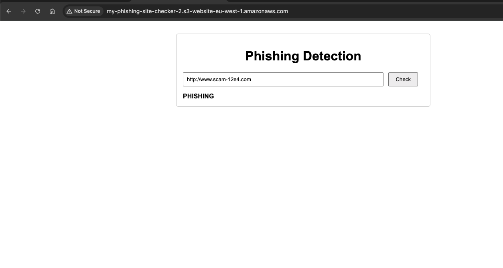

# 🛡️ Phishing Detection

## 🔧 Setup and Data

This project uses several key Python libraries for data processing and model training, listed in `requirements.txt`.  
AWS services are required.

### To Get Started:

Clone the repository into SageMaker Studio:

```bash
git clone https://github.com/Harish8622/phishing_detection.git
```

1. **Install Dependencies:**

```bash
pip install -r requirements.txt
```

2. **Download the Dataset:**

The dataset can be obtained from the [UCI Machine Learning Repository - PhiUSIIL Phishing URL dataset](https://archive.ics.uci.edu/dataset/967/phiusiil+phishing+url+dataset).
> **Note:** The training data is note included in this repo for size reasons.

3. **Upload to S3:**

Upload the dataset to an S3 bucket (e.g., `s3://your-bucket/initial_dataset/`). This ensures that it is accessible for your SageMaker training jobs.

---

## ✅ Instructions

Follow the steps as outlined in the Jupyter notebooks.

---

## 📂 Repo Overview

### `notebook/`
- `eda_notebook.ipynb`: Initial feature engineering, data exploration and cleaning.
- `Benchmark-model-notebook.ipynb`: Logistic Regression model using only `URLLength` as a baseline.
- `training_notebook_v1.ipynb`: Full feature engineering and initial XGBoost training.
- `training_notebook_v2.ipynb`: Refined feature set, final model training, and endpoint deployment.

### `lambda_functions/`
Contains the Lambda function code for real-time inference. It processes input URLs, computes features, and calls the SageMaker endpoint.

### `data/`
Holds cleaned datasets and trained model files. Final model data is in `data/local_model_data/xgboost-v2`.

### `API Gateway/`
Contains `index.html` for the web interface.

### `tests/`
Contains unit tests: `test_feature_engineering.py`.

---

## 🌐 Domain Background

The dataset was downloaded into an **S3 bucket**.

- **Label 1**: Legitimate URL
- **Label 0**: Phishing URL

Distribution:
- Legitimate (1): 57.19%
- Phishing (0): 42.81%

Since the minority class exceeds 40%, the dataset is treated as balanced. No resampling is required, as per [Google’s ML Crash Course on imbalanced datasets](https://developers.google.com/machine-learning/crash-course/overfitting/imbalanced-datasets).

---

## ⚖️ Feature Engineering & Preprocessing

## ⚖️ Feature Engineering & Preprocessing

(See `EDA notebook`)

Initially, all the feature columns of the dataset were dropped. This is because there was no publically available feature engineering code to produce these features from raw strings. This would pose a challenge in performing inference on unseen url strings. Features have to be able to be derived from the **raw URL string**.

- To combat this, custom feature engineering logic was developed to compute all of these features from scratch from just the url string, this enables consistency in feature computation between training and inference.


- An `entropy` feature was engineered to quantify the randomness of characters in a URL — a common trait of phishing attempts.

A correlation analysis was performed to identify and remove redundant or collinear features. 

The final cleaned dataset was uploaded to S3 was split into test/train/validation data and uploaded to S3.

---

## 🏆 Benchmark Model

(See `benchmark model notebook`)

A benchmark model was created using **logistic regression**. This benchmark used only the `URLLength` feature to provide a simple but measurable benchmark.

### Benchmark Results

The logistic regression baseline achieved the following performance:
- **Accuracy**: 0.7425
- **Precision**: 0.7201
- **Recall**: 0.8994
- **F1 Score**: 0.7998

---

## 📊 XGBoost - Training Notebook 1

he final model was trained using Amazon SageMaker’s built-in XGBoost algorithm, eliminating the need for a custom training script. To improve parallelism, training was run across two instances (note: this is optional but serves as a good demonstration of distributed training). The data was fully replicated, although a sharded approach could be taken.

For compatibility with the built-in XGBoost container (version 1.7.1), it was necessary to:
- Remove any header rows from the dataset.
- Ensure that the label column is the first column in the dataset.

#### Initial Model Performance

**Classification Report:**

| Class | Precision | Recall | F1-score | Support |
|-------|-----------|--------|----------|---------|
| **0** (phishing) | 1.00 | 0.99 | 0.99 | 15142 |
| **1** (legitimate) | 0.99 | 1.00 | 1.00 | 20227 |

- **Accuracy:** 0.9953
- **Macro Average:** Precision=1.00, Recall=0.99, F1-score=1.00  
- **Weighted Average:** Precision=1.00, Recall=1.00, F1-score=1.00  

**Confusion Matrix:**

|                | Predicted: Phishing (0) | Predicted: Legitimate (1) |
|----------------|-------------------------|---------------------------|
| **Actual: Phishing (0)**    | 15008                  | 134                       |
| **Actual: Legitimate (1)**  | 32                     | 20195                     |

This matrix highlights how the model maintains very low false positives and false negatives.


**Training Convergence:**

The log loss plot can be seen below, showing that 300 rounds was sufficient for the model to converge.


### Feature Importance
After training the initial XGBoost model, the feature importance was computed to understand which features were contributing to the model and which were not.
- Features not contributing could be removed to help simplify pre processing in inference and improve inference time.


Dropped Features:
- IsDomainIP
- NoOfEqualsInURL
- NoOfQMarkInURL
- URLEntropy

---

## 📊 Final Model - Training Notebook 2

**Final Features:**
- label
- URLLength
- DomainLength
- NoOfSubDomain
- LetterRatioInURL
- NoOfAmpersandInURL
- SpacialCharRatioInURL
- IsHTTPS
- CharContinuationRate

### Final Performance

The model was retrained using this reduced set of features and achieved the following:
**Classification Report (Final Model):**

| Class             | Precision | Recall | F1-Score | Support |
|-------------------|-----------|--------|----------|---------|
| **Phishing (0)**  | 1.00      | 0.99   | 0.99     | 15142   |
| **Legitimate (1)**| 0.99      | 1.00   | 1.00     | 20228   |

- **Accuracy:** 0.9954 
- **Macro Average:** Precision=1.00, Recall=0.99, F1-score=1.00  
- **Weighted Average:** Precision=1.00, Recall=1.00, F1-score=1.00  

**Confusion Matrix:**

|                | Predicted: Phishing (0) | Predicted: Legitimate (1) |
|----------------|-------------------------|---------------------------|
| **Actual: Phishing (0)**    | 15012                  | 130                       |
| **Actual: Legitimate (1)**  | 33                     | 20195                     |

**Hyperparameters:**
- eta: 0.2
- gamma: 4
- max_depth: 5
- min_child_weight: 6
- num_round: 300
- objective: binary:logistic
- subsample: 0.7

### Performance Summary

| Model Variant | Accuracy | Final Validation Log-Loss | Notes |
|---------------|----------|---------------------------|-------|
| Logistic Regression | 0.7425 | N/A | Baseline with URLLength only |
| XGBoost (full) | 0.9953 | 0.01907 | Full feature set |
| XGBoost (reduced) | 0.9953 | 0.01876 | Final model |

- The final model achieves very high accuracy and low error rates, maintaining strong performance even after feature reduction.

---

## 🌐 Final Deployment & Inference

After `training_notebook_2`, the endpoint is deployed.

- Set up autoscaling policy  for the endpoint as shown below. This was note neccessary for this demo but is just a demonstration that this is a scalable solution capable of handling many requests. The values can be adjusted as required.
  

- Create a Lambda function and copy code from `lambda_functions/lambda_function.py`
    - The lambda function pre processes the input url string and calls the endpoint and returns the result
- Ensure Lambda has **SageMaker Full Access** so it can invoke an endpoint
- Set endpoint name in the lambda function code

### Test Lambda Examples
- below are two examples of testing the lambda function, showing it returns the expected result.

**Phishing Input:**
```json
{
  "body": "{"url": "http://secure-bank.com.login-now.co"}"
}
```
**Response:**
```json
{
  "features": "35,28,2,0.771,0,0.229,0,0.058824",
  "prediction_score": 1.43e-07,
  "prediction_label": "phishing"
}
```

**Legitimate Input:**
```json
{
  "body": "{"url": "https://www.google.com"}"
}
```
**Response:**
```json
{
  "features": "22,14,1,0.773,0,0.227,1,0.238095",
  "prediction_score": 0.9979,
  "prediction_label": "legitimate"
}
```

- Furthermore inference was quick in just over 200 ms as shown be below screenshot


---

##  HTTP API Endpoint

Used **AWS API Gateway (HTTP API)** for its native CORS support.

**Example `curl` Request:**
```bash
curl -X POST "https://your-api-id.execute-api.eu-west-1.amazonaws.com/phishing-detection"   -H "Content-Type: application/json"   -d '{"url": "https://www.example.com"}'
```
> **Note:** This demo does not use API key validation to simplify testing. For production deployments, API authentication and proper access control should be implemented using a REST API with an API key or other secure mechanisms.

**Response:**
```json
{
  "features": "23,15,1,0.783,0,0.217,1,0.181818",
  "prediction_score": 0.9985,
  "prediction_label": "legitimate"
}
```

---

## 🌍 Web UI Demonstration
- To demonstrate that the current solution can be integrated into a frontend application, a simple web UI was created. This interface allows users to input a URL, sends the request to the deployed inference API, and displays whether the URL is classified as phishing or legitimate.
- A simple `index.html` file is used for this.
    - A **generative AI** tool was used to generate this html file as this is for demonstration purposes only.
- Submits the URL to API Gateway via `fetch()`
- Displays the prediction result in the browser.

### Hosting on S3:

1. Upload `index.html` to your S3 bucket.
2. Enable static website hosting.
3. Make the bucket publicly accessible.
4. Visit: `http://your-bucket-name.s3-website-region.amazonaws.com`


### Web UI Screenshots

**Legitimate Example:**



**Phishing Example:**



---
 
## ✅ Unit Testing

Run tests using:
```bash
pytest -s -v tests/test_feature_engineering.py
```

## End of Project

**Delete all resources** to prevent unused costs, this includes:

- Shutting down notebook instances
- Deleting API's
- Deleting endpoints

---

## 🌟 Future Steps
- Containerise the application using Docker to ensure consistent deployment across environments and simplify local development.
- Improve test coverage with unit and integration tests for feature engineering, Lambda handler, and API responses.
- Add authentication and rate limiting using API Gateway usage plans or AWS Cognito to secure the public-facing API.
- Log prediction requests and outcomes using AWS CloudWatch or a custom logging pipeline to support auditing and improvement of model accuracy.
